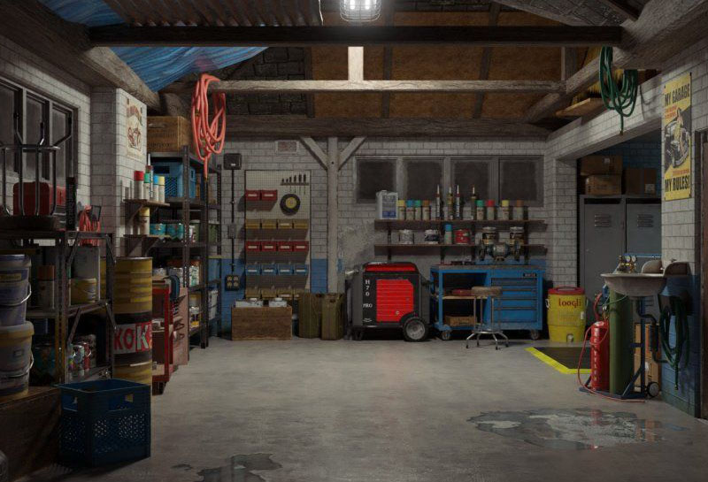
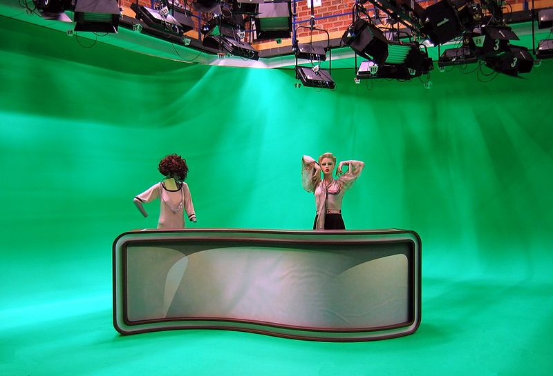
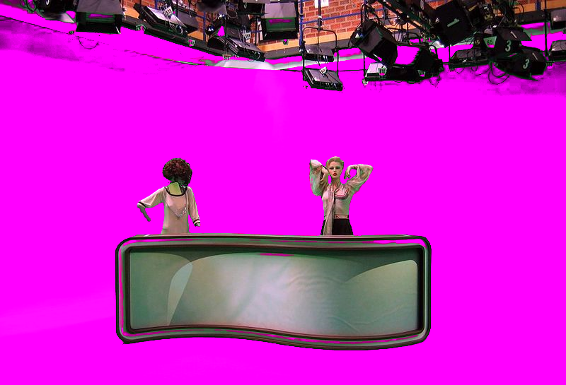
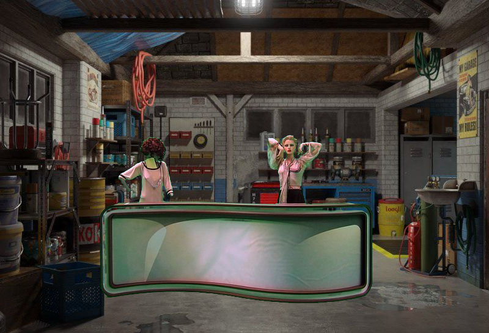

###     VirtualCamWithChromakey

Show how to remove background (chromakey technique) from one camera and send in to virtual.    

Contains several remove background (chromakey technique) algorythms:   
- RGBChromakeyRemover (supports obly basic color: red, green, blue)
- YCbCrChromakeyRemover (supports any color)
- RGB3DChromakeyRemover (supports any color)
- GrayScaleChromakeyRemover (supports any color)
- ColorMetricChromakeyRemover (supports any color)
- HSVChromakeyRemover (supports any color)

// Entry Point    
dkxce.RealCamToVirtualCamRouter.Route()

YCbCrChromakeyRemover.Test() Results:    

background image:   
         
ovelay image:   
  
removed greenbox image:   
  
mixed image:   
 

Other results [here](https://github.com/dkxce/VirtualCamWithChromakey/tree/main/images)
